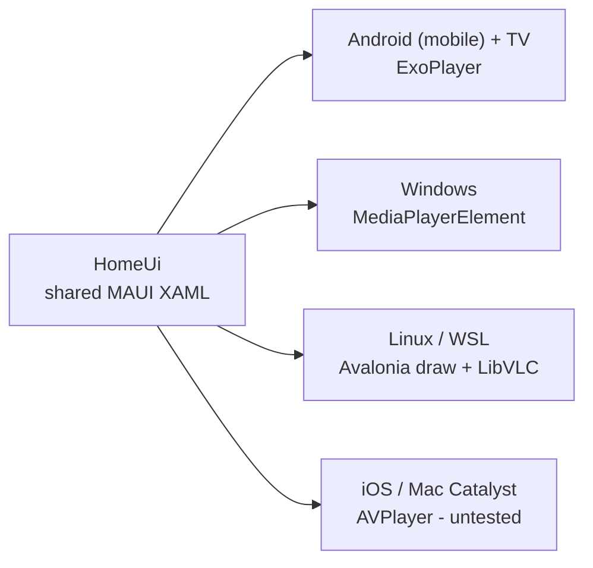
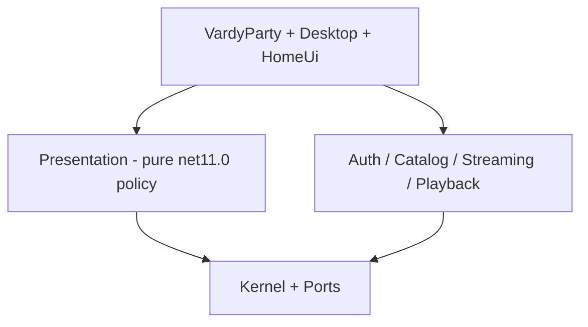

# VardyParty

A cross-platform live match streaming app. One shared MAUI XAML homepage on every
target; native players own video. Built for **v2.0.0**.

## Install

You need the **.NET 11 preview SDK** on every head (distro/apt .NET 10 fails with
`NETSDK1045`). Start with the install doc for your machine:

- **Linux / WSL** — [docs/LINUX_SUPPORT.md](docs/LINUX_SUPPORT.md): install the
  .NET 11 preview SDK, `dotnet workload install maui-tizen`, and pin
  `HomeUiTargetFrameworks=net11.0` for restore and run.
- **Windows** — [docs/WINDOWS_INSTALL.md](docs/WINDOWS_INSTALL.md)
- **Android (mobile)** and **Android TV** — [docs/LOCAL_ANDROID_BUILD.md](docs/LOCAL_ANDROID_BUILD.md)
  (`package-android.ps1` produces `arm64-v8a` phones and `armeabi-v7a` TV)

Architecture, playback, versioning, and the merge playbook stay in the
[Documentation](#documentation) table below — they are not the first step.

## Highlights

- **.NET 11** — MAUI and the Linux desktop head both target `net11.0` / `net11.0-*`.
  Install the preview SDK first (see [Install](#install)).
- **Avalonia MAUI backend** — on Linux, the same `VardyParty.HomeUi` XAML is drawn by
  Avalonia (`UseAvaloniaApp` / `Avalonia.Controls.Maui.Desktop`), not a second UI stack.
  See [docs/architecture/homepage-maui-avalonia.md](docs/architecture/homepage-maui-avalonia.md).
- **Video on Linux / WSL** — playback is **LibVLC in a native window**, not hosted inside
  Avalonia controls. The Desktop build runs under WSL with working video + audio.
- **Android (mobile)** and **Android TV** — phones use `arm64-v8a`; 32-bit Android TV
  is exercised on ARM `armeabi-v7a` sets (e.g. Sony BRAVIA). D-pad / 10-foot UI is
  **Android TV only**.

VardyParty aggregates live streams, health-checks them, and plays with automatic failover
when a feed dies.



## Documentation

Full index: **[docs/INDEX.md](docs/INDEX.md)**

| Doc | Why open it |
|-----|-------------|
| [docs/ARCHITECTURE.md](docs/ARCHITECTURE.md) | Assemblies, heads, pick→play diagrams |
| [docs/architecture/homepage-maui-avalonia.md](docs/architecture/homepage-maui-avalonia.md) | Shared homepage + Avalonia Linux backend |
| [docs/STREAM_PLAYBACK_RULES.md](docs/STREAM_PLAYBACK_RULES.md) | Playback session / engine contract |
| [docs/STREAM_HEALTH_PROTOCOL.md](docs/STREAM_HEALTH_PROTOCOL.md) | Health-check protocol |
| [docs/LINUX_SUPPORT.md](docs/LINUX_SUPPORT.md) | .NET 11 preview + run Desktop / WSL |
| [docs/LOCAL_ANDROID_BUILD.md](docs/LOCAL_ANDROID_BUILD.md) | Local APK (`package-android.ps1`) |
| [docs/WINDOWS_INSTALL.md](docs/WINDOWS_INSTALL.md) | Windows install / sideload |
| [docs/VERSION_MANAGEMENT.md](docs/VERSION_MANAGEMENT.md) | Semver + build counter (`Version.props`) |
| [docs/agent-playbook-merge-client-pr-v2.md](docs/agent-playbook-merge-client-pr-v2.md) | Land a PR so main releases **v2.0.0** |
| [.github/CI-CD-SETUP.md](.github/CI-CD-SETUP.md) | CI / CD / Release workflows |

## Tech Stack

- **.NET 11** (preview) — shared libraries + MAUI hosts + Linux desktop
- **.NET MAUI** with a shared **MAUI XAML homepage** (`VardyParty.HomeUi`)
- **Avalonia MAUI backend** (Avalonia 12 preview) draws that homepage on Linux
  (`VardyParty.Desktop`)
- **C#** with nullable reference types
- **Auth0** for authentication (including QR-code device flow for TV)
- **System.Reactive** for reactive/observable patterns around stream updates
- Platform-specific native video players (not the UI toolkit):
  - **Android**: ExoPlayer with HLS support
  - **iOS / macOS**: AVPlayer
  - **Windows**: MediaPlayerElement
  - **Linux / WSL**: LibVLC (separate native video window — not Avalonia `VideoView`)

## Supported Platforms

- ✅ **Android (mobile)** + **Android TV** (`arm64-v8a` phones + `armeabi-v7a` TV)
- ✅ **Windows** 10/11
- ✅ **Linux** (x64 and ARM64), including **WSL**, via `VardyParty.Desktop`
- ⏳ **iOS** — CI builds; **untested** pending Apple Developer Account
- ⏳ **macOS (Mac Catalyst)** — CI builds; **untested** pending Apple Developer Account

## Key Features

- **Live fixtures** -- Aggregates today's matches by league, enriches with BBC status/scores, and refreshes while you browse.
- **Stream Resolution & Health Checking** -- Discovers streams from multiple sources, tests their health (manifest availability, segment loading) in parallel, and prioritises healthy ones.
- **Automatic Stream Switching** -- Monitors playback health and seamlessly switches to backup streams on failure, maintaining a pool of healthy streams.
- **Native Video Playback** -- Platform-specific HLS/M3U8 players with custom header support; Linux video stays outside the Avalonia-drawn UI tree.
- **Android (mobile)** and **Android TV** -- phones plus 32-bit ARM TV field target. D-pad focus/scroll ownership is **Android TV** only; QR-code login and shared homepage chrome cover both.
- **Auth0 Authentication** -- Interactive login on mobile/desktop, device flow with QR code for TV.

## Project Structure

```
VardyParty/                  # Main MAUI application (Android/iOS/macOS/Windows)
├── HomeHostPage.xaml        # Hosts the shared XAML homepage + auth/resolve overlays
├── Platforms/               # Platform-specific implementations
│   ├── Android/             # Android services (video player, TV detection)
│   ├── iOS/                 # iOS video player
│   ├── MacCatalyst/         # macOS video player
│   └── Windows/             # Windows video player & overlay controls
├── Services/                # App-level services
└── Resources/               # Images, fonts, sounds, splash screens

VardyParty.HomeUi/           # Shared MAUI XAML homepage (rows, cards, brand logo)

VardyParty.Desktop/          # Linux desktop head (MAUI drawn by Avalonia)
├── Pages/                   # DesktopHomePage (device-code QR sign-in, playback)
└── Services/                # Auth0 device flow, LibVLC playback, UI sounds

VardyParty.Kernel/           # Shared models + config POCOs
VardyParty.Ports/            # Playback ports (launcher, switching, candidate rules)
VardyParty.Auth/             # Identity (token session, Auth0 HTTP, handler)
VardyParty.Catalog/          # Matcher, BBC, league filter, ticker, home presentation
VardyParty.Streaming/        # Orchestrator, resolvers, LAN, stream/M3U8 HTTP, health
VardyParty.Playback/         # Playback policy/session, switching pool, player ports
VardyParty.Presentation/     # Shared HomeShell/Menu view-models
VardyParty.Hosting/          # AddVardyParty() composition
```

## Architecture (short)

Heads depend inward on pure policy assemblies; UI does not own playback recovery.



Details: [docs/ARCHITECTURE.md](docs/ARCHITECTURE.md).
