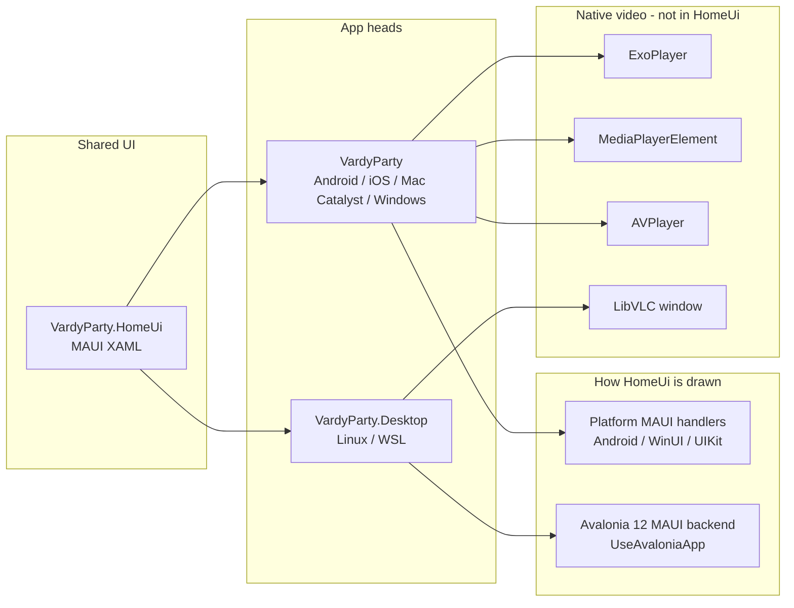
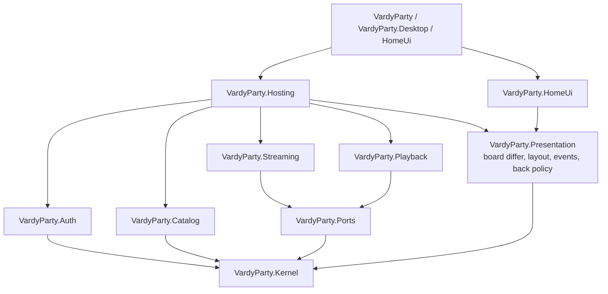
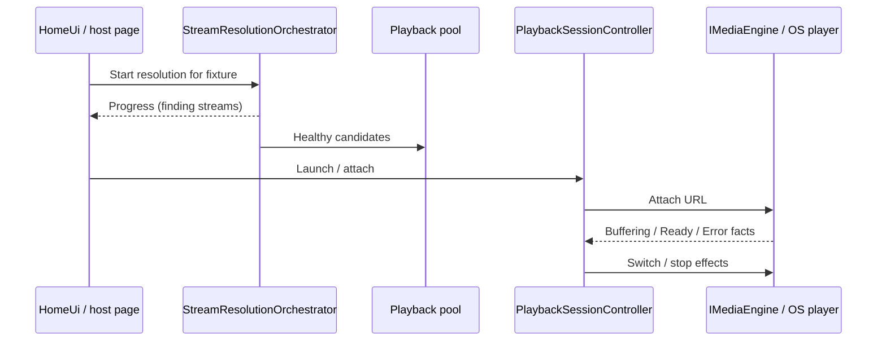

# VardyParty architecture

One shared MAUI XAML homepage (`VardyParty.HomeUi`), five heads, native players
outside the UI toolkit. Domain policy lives in plain `net11.0` assemblies and is
unit-tested without MAUI/Avalonia.

For the homepage rewrite (Blazor → XAML, Avalonia on Linux, TV focus/clip), see
[architecture/homepage-maui-avalonia.md](architecture/homepage-maui-avalonia.md).
For playback rules, see [STREAM_PLAYBACK_RULES.md](STREAM_PLAYBACK_RULES.md).

## Heads and renderers

| Head | UI | Video | Field status |
|------|----|-------|--------------|
| Android phone / **32-bit TV** | MAUI handlers | ExoPlayer | Verified |
| Windows | MAUI → WinUI | MediaPlayerElement | Verified |
| Linux / **WSL** | MAUI → Avalonia | LibVLC (separate window) | Verified |
| iOS / Mac Catalyst | MAUI → UIKit | AVPlayer | CI builds; untested pending Apple Developer Account |

## Domain assemblies (inward dependencies)

`VardyParty.Presentation` has **no** MAUI/Avalonia references. Heads depend
inward; policy does not depend on UI.

## Request path (pick a match → play)

## Related docs

| Doc | Role |
|-----|------|
| [architecture/homepage-maui-avalonia.md](architecture/homepage-maui-avalonia.md) | Homepage + Linux Avalonia backend deep dive |
| [STREAM_PLAYBACK_RULES.md](STREAM_PLAYBACK_RULES.md) | Session controller / engine contract |
| [STREAM_HEALTH_PROTOCOL.md](STREAM_HEALTH_PROTOCOL.md) | Health checking protocol |
| [LINUX_SUPPORT.md](LINUX_SUPPORT.md) | .NET 11 preview + Desktop run on Linux/WSL |
| [VERSION_MANAGEMENT.md](VERSION_MANAGEMENT.md) | `Version.props` + release versioning |
