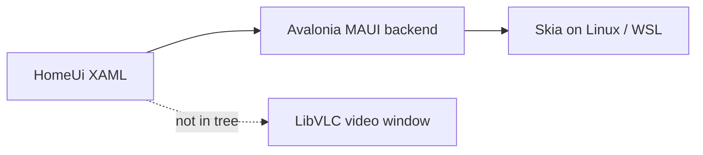

# Linux Support

Linux is served by **`VardyParty.Desktop`**: the shared .NET MAUI XAML homepage
(`VardyParty.HomeUi`) drawn by the Avalonia 12 preview MAUI backend, with Auth0
device-code/QR sign-in and **LibVLC playback in a native window** (not hosted
inside Avalonia controls).



Deep dive: [architecture/homepage-maui-avalonia.md](architecture/homepage-maui-avalonia.md).

The Desktop head targets **net11.0**. A .NET 10 SDK (Ubuntu apt or an old
`~/.dotnet`) fails with `NETSDK1045`. Use the **.NET 11 preview SDK**, same
band as the Windows MAUI head: `11.0.100-preview.7` or later
(`11.0.100-preview.7.26381.103` is the known-good pin).

## Install the .NET 11 preview SDK (Ubuntu)

Do **not** retarget the repo to net10. Install the preview SDK locally so it
does not fight distro packages.

```bash
curl -sSL https://dot.net/v1/dotnet-install.sh -o /tmp/dotnet-install.sh
chmod +x /tmp/dotnet-install.sh
/tmp/dotnet-install.sh --channel 11.0 --quality preview --install-dir "$HOME/.dotnet"
```

To pin the same SDK as Windows/CI:

```bash
/tmp/dotnet-install.sh --version 11.0.100-preview.7.26381.103 --install-dir "$HOME/.dotnet"
```

Put that host **first** on `PATH` (otherwise `/usr/lib/dotnet` 10.x wins):

```bash
echo 'export DOTNET_ROOT="$HOME/.dotnet"' >> ~/.bashrc
echo 'export PATH="$HOME/.dotnet:$PATH"' >> ~/.bashrc
source ~/.bashrc
```

Check:

```bash
which dotnet
dotnet --version    # 11.0.100-preview.7… not 10.0.x
dotnet --list-sdks
```

Official downloads: <https://dotnet.microsoft.com/download/dotnet/11.0>.
Scripted install: <https://learn.microsoft.com/en-us/dotnet/core/install/linux-scripted-manual>.

## Run the Desktop head

The `maui-tizen` workload carries the plain-TFM MAUI SDK on Linux. You do
**not** need the `android` workload to run the Desktop head — but you must
pin HomeUi to `net11.0` in the **environment**, not rely on the Desktop
head's `ProjectReference` pin alone. HomeUi on Linux defaults to
`net11.0;net11.0-android` (so APK-from-Linux restore has the android TFM),
and restore evaluates HomeUi with those defaults regardless of the
`ProjectReference` `AdditionalProperties` — a plain
`dotnet run --project VardyParty.Desktop/...` therefore fails with
NETSDK1147 ("workloads must be installed: android") when the android
workload is absent. CI's build-desktop job, the unit-test job and
`scripts/launch-linux-app.cmd` all use the same fix: set
`HomeUiTargetFrameworks=net11.0` for restore AND build so HomeUi's android
target never enters the desktop build graph.

```bash
dotnet workload install maui-tizen
dotnet restore VardyParty.Desktop/VardyParty.Desktop.csproj -p:HomeUiTargetFrameworks=net11.0
dotnet run --project VardyParty.Desktop/VardyParty.Desktop.csproj -c Release --no-restore -p:HomeUiTargetFrameworks=net11.0
```

> Pass the pin as `-p:` per command — do NOT `export HomeUiTargetFrameworks`
> into your shell. A lingering export silently drops HomeUi's android target
> from every later Android build in that shell (Linux/WSL evaluation only)
> and fails restore with cryptic NETSDK1005/1147 errors. `package-android.ps1`
> neutralises the variable defensively, but plain `dotnet build` commands
> won't.

For video playback:

```bash
sudo apt install vlc libvlc-dev
```

From Windows/WSL, `scripts/launch-linux-app.cmd` builds and launches the
Desktop head inside WSLg. That script calls `$HOME/.dotnet/dotnet` directly,
so step 1 is enough even if `which dotnet` is still 10. It pins
`HomeUiTargetFrameworks=net11.0` itself (no android workload needed) and, if
NETSDK1147 still surfaces, prints the fallback remedy
(`dotnet workload install android`).

## Secrets (Auth0 / API)

Committed `VardyParty.Desktop/appsettings.json` is a **template** (empty Auth0
Domain/ClientId/Audience and production API URLs). Builds must enrich it:

| Path | How secrets are injected |
|------|--------------------------|
| **CD snap jobs** | `.github/workflows/cd.yml` → `Generate appsettings.json for Linux` |
| **release.yml Linux** | `scripts/merge-appsettings-secrets.sh` from Actions secrets |
| **Local `launch-linux-app.cmd`** | Merges .NET user-secrets (same `UserSecretsId` as MAUI), then `git restore`s the template on exit |
| **Local `dotnet` with patch** | `-p:PatchAppSettings=true` on `VardyParty.Desktop` (pwsh or bash merge) |

One-time local setup (same store as Android):

```bash
dotnet user-secrets set "Auth0:Domain" "your-tenant.auth0.com" --project VardyParty.Desktop/VardyParty.Desktop.csproj
dotnet user-secrets set "Auth0:ClientId" "your-client-id" --project VardyParty.Desktop/VardyParty.Desktop.csproj
dotnet user-secrets set "Auth0:Audience" "your-audience" --project VardyParty.Desktop/VardyParty.Desktop.csproj
# … Scope, CallbackScheme, RedirectUri, PostLogoutRedirectUri, TokenLeewaySeconds,
#   RequiredRoleClaimType, RequiredRole, Api:HeadlessBaseUrl — see docs/LOCAL_ANDROID_BUILD.md
```

Or pass `-p:PatchAppSettings=true` on restore/run after the secrets exist:

```bash
dotnet run --project VardyParty.Desktop/VardyParty.Desktop.csproj -c Release \
  -p:HomeUiTargetFrameworks=net11.0 -p:PatchAppSettings=true
git restore VardyParty.Desktop/appsettings.json
```
