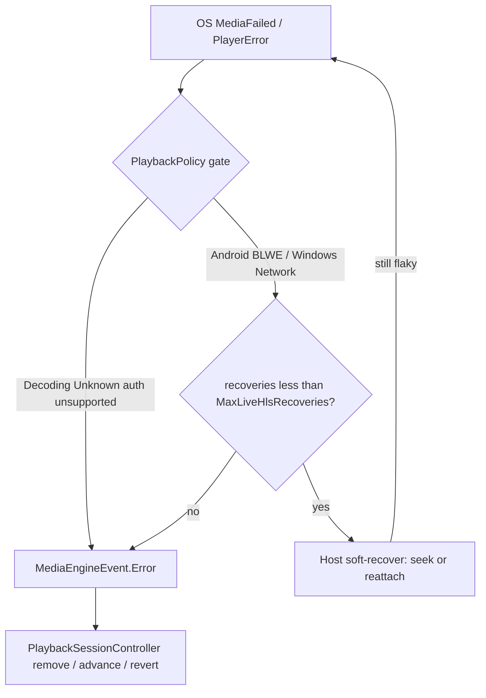

# Stream Playback Rules

**STATUS:** Android, Windows, Linux, and Apple hosts execute `PlaybackSessionController` effects through `DelegatingMediaEngine` (`IMediaEngine`). OS players attach/stop/raise facts only.  
**AUDIENCE:** Developers and AI assistants working on MAUI/Desktop stream handling (Android, Android TV, Windows, Linux/WSL)  
**RELATED:** [STREAM_HEALTH_PROTOCOL.md](STREAM_HEALTH_PROTOCOL.md)

### Implementation

| Type | Path | Role |
|------|------|------|
| `PlaybackPolicy` | `VardyParty.Playback/Domain/PlaybackPolicy.cs` | Pure rules (attach, navigate, revert, cache retry, decline) |
| `PlaybackSessionController` | `VardyParty.Playback/Domain/PlaybackSessionController.cs` | State machine: engine events → effects |
| `PlaybackCommand` | `VardyParty.Playback/Domain/PlaybackCommand.cs` | Collapses effect batches (remove+advance must not skip) |
| `IMediaEngine` | `VardyParty.Playback/Application/IMediaEngine.cs` | Slim OS contract (Attach/Stop/events/metrics only) |
| `DelegatingMediaEngine` | `VardyParty.Playback/Infrastructure/DelegatingMediaEngine.cs` | Host adapter: OS plugs attach/stop/metrics, raises facts |
| Effects / events | `PlaybackEffect.cs`, `MediaEngineEvent.cs` | Host executes effects; engine emits facts |
| `PlaybackCommandExecutor` | `VardyParty.Playback/Domain/PlaybackCommandExecutor.cs` | Interprets flags; every OS host uses this |
| `PlaybackPoolCommandActions` | `VardyParty.Playback/Domain/PlaybackPoolCommandActions.cs` | Pool clear/remove/retry/attach-current for **every** host; fresh URL accept uses `PlaybackPolicy.ShouldAcceptFreshM3U8` against session current URL |
| Android host | `Platforms/Android/NativeVideoActivity.Playback.cs` | ExoPlayer facts → same loop; pool via `PlaybackPoolCommandActions` |
| Windows host | `Platforms/Windows/WindowsVideoPlayerService.Playback.cs` | WinUI facts → same loop; pool via `PlaybackPoolCommandActions` |
| Linux host | `VardyParty.Linux/Services/LinuxVideoPlayerService.cs` | LibVLC facts → same loop; chrome via Avalonia `LinuxPlaybackChromeWindow` over native child airspace; host-window fullscreen keeps overlay placeable |
| iOS host | `Platforms/iOS/IOSVideoPlayerService.cs` | AVPlayer asset; session/executor/pool in `AppleVideoPlayerServiceBase` (`#if IOS \|\| MACCATALYST`, namespace `VardyParty`) |
| MacCatalyst host | `Platforms/MacCatalyst/MacCatalystVideoPlayerService.cs` | AVPlayer asset; same shared Apple base |
| Tests | `tests/VardyParty.Playback.Tests/Playback*.cs`, `FakeMediaEnginePlaybackTests.cs`, `StreamMetricsWindowTests.cs`, `DelegatingMediaEngineTests.cs`; orchestrator cache retry in `tests/VardyParty.Streaming.Tests/StreamResolutionOrchestratorTests.cs`; health identity/reporter in `tests/VardyParty.Streaming.Tests/` | Policy + session + command collapse + fake `IMediaEngine` host loop + orchestrator cache retry |

---

## Testing seam (OS vs Core)

Business recovery must stay under unit tests. OS decoder/chrome differences are large (ExoPlayer vs WinUI AdaptiveMediaSource, TV remote, request headers, Activity vs MediaPlayer). Those do **not** belong in domain unit-test projects.

**Do test via a common interface:**

```
ExoPlayer / WinUI / FakeMediaEngine  →  IMediaEngine (facts only)
                                         ↓
                              PlaybackSessionController
                                         ↓
                         host executes PlaybackCommand (pool, resolve, health)
```

`FakeMediaEnginePlaybackTests` is the OS-shaped business test: a fake engine implements `IMediaEngine`, a tiny host interprets `PlaybackCommand` the same way Android, Windows, Linux, and Apple do.

**Do not share one fat player interface** (`INativeVideoPlayerService` stays a launch/chrome contract: `PlayVideoAsync`, overlay, referer). Collapse OS recovery into `IMediaEngine` + session, not into a second policy class per platform.

Health reports key on the catalog/page URL via `StreamHealthIdentity.ResolveReportUrl` (ephemeral `.m3u8`/`.mpd` URLs are not the crowd identity). Cache→fresh retry is covered by `StreamResolutionOrchestratorTests`. The old Blazor `/player` single-URL path (`VideoPlayer.razor`) was deleted with the WebView UI.

---

## Goal

One set of business rules for stream **selection → start → survive → switch → recover**.  
OS code should only attach/detach media and surface metrics/errors. Shared domain owns decisions.

Today: selection/pre-play is shared; **runtime recovery is Playback** (`PlaybackSessionController`) on Android, Windows, Linux/Desktop, and Apple. Hosts only attach/stop and raise engine facts.

---

## As-is architecture

```
HomeHostPage / LinuxHomePage
  └─ StreamResolutionOrchestrator          ← shared select / start / post-PlayVideoAsync failure
       ├─ StreamSelectionCoordinator
       ├─ StreamResolver + StreamHealthChecker
       ├─ StreamSwitchingService            ← healthy pool + index Rx
            └─ INativeVideoPlayerService.PlayVideoAsync(...)
                 ├─ Android (+ TV): NativeVideoActivity + DelegatingMediaEngine (ExoPlayer)
                 ├─ Windows: WindowsVideoPlayerService + DelegatingMediaEngine (WinUI)
                 ├─ Linux/WSL: LinuxVideoPlayerService + DelegatingMediaEngine (LibVLC window)
                 ├─ iOS: Platforms/iOS + AppleVideoPlayerServiceBase (AVPlayer)
                 └─ MacCatalyst: Platforms/MacCatalyst + AppleVideoPlayerServiceBase (AVPlayer)
                      all: engine facts → PlaybackSessionController → PlaybackCommandExecutor
                           pool/retry: PlaybackPoolCommandActions in VardyParty.Playback
```

Android phone and Android TV share the same ExoPlayer activity; TV differs mainly in remote/overlay focus (`MauiProgram.IsTv`, `RemoteKeyHandler`).

---

## Phase matrix

| Phase | Shared Core | Android / Windows / Linux | Notes |
|-------|-------------|---------------------------|-------|
| **Select / order** | Recommendations + catalog order + FB-before-MP | Uses Core | Keep in Core |
| **Pre-play probe** | `StreamHealthChecker` | Uses Core | Keep in Core |
| **Skip countdown** | `StreamResolver` skips `IsCountdown` | — | Keep |
| **Start first healthy** | First healthy → `PlayVideoAsync`; continue testing | Attaches ExoPlayer / AdaptiveMediaSource / LibVLC | Keep |
| **Cache → fresh retry** | Once if cached M3U8 fails (CDN token) | Hosts attach whatever URL Core gives | Covered by `StreamResolutionOrchestratorTests` |
| **Prefetch next M3U8** | `PrefetchUpcomingStreamUrl` | Index change rebinds | Keep |
| **User Next / Prev** | Session `UserNext` / `UserPrevious` | Rebind URL; **must not** mark bad | Shared policy |
| **Hard playback error** | Session `Error` → remove + advance or revert | `engine.Raise(Error)` | One policy |
| **Soft live-HLS recover** | `PlaybackPolicy.MaxLiveHlsRecoveries` (+ BLWE / network gates) | Android: seek-to-live on BLWE; Windows: AdaptiveMediaSource reattach on **NetworkError only**; Linux: `--http-reconnect` (no budget) | Host-local; no session Error until budget exhausted |
| **Soft decline (buffer/bitrate)** | `StreamMetricsWindow` via session Metrics/Buffering | Android 30s metrics; Windows throttled PositionChanged; Linux 30s timer | Shared window |
| **Brief rebuffer tolerance** | `DesiredLiveOffsetSeconds` + Android LoadControl ms constants | Windows DesiredLiveOffset; Android DefaultLoadControl; Linux `--network-caching` | Named in `PlaybackPolicy` |
| **Failed switch** | Restore last-good once | Hosts execute `PlaybackCommand` | Locked by `PlaybackUnificationRulesTests` |
| **Failed start (never established)** | Remove + advance if pool remains | Hosts execute `PlaybackCommand` | Shared |
| **Stale failure during switch** | Ignore if `generation != AttachGeneration` | Hosts compare session generation | Shared |
| **Buffering → Core** | Session Buffering effect | All three raise `MediaEngineEvent.Buffering` | Always raise |
| **Health reports** | `StreamHealthIdentity.ResolveReportUrl` (page over M3U8) | Android still passes M3U8+referer; reporter prefers page | Single identity |

---

## Detailed as-is rules

### 1. Selection & pre-play (Core — keep)

1. Build candidate queue (`StreamSelectionCoordinator`); apply crowd recommendations when confidence is high/medium.
2. Expand V2 / order catalog sources; prefer FB-before-MP where applicable.
3. Skip streams with countdown active on the page.
4. Resolve M3U8 via LAN play service / API; probe with `StreamHealthChecker`.
5. Probe outcomes: `Healthy` | `ManifestUnreachable` | `InvalidManifest` | `EmptyManifest` | `SegmentUnreachable`.
6. Deduplicate healthy URLs in the switching pool.
7. Play the **first** healthy stream immediately; keep resolving others in the background.

### 2. Start & cache retry (Core — keep)

1. Prefer `ResolvedM3U8Url` from probe/prefetch.
2. If playback fails and a cached URL was used (and user did not close), resolve fresh once; retry only if the fresh URL differs.
3. Prefetch the upcoming candidate’s M3U8 while current plays.

### 3. Switch eligibility (partially shared)

Shared helper `SwitchingDecision.CanSwitch(currentUrl, candidateUrl, isPreparing)`:

- Reject empty candidate
- Reject while preparing
- Reject same URL (case-insensitive)

Android duplicates this in `NativeVideoActivity.CanSwitchTo`. Windows uses local guards (`suppressIndexDrivenSwitch`, same URL, generation). **Target:** all platforms call `SwitchingDecision` (or successor).

### 4. Android recovery (`NativeVideoActivity`)

ExoPlayer facts go through `DelegatingMediaEngine` → `PlaybackSessionController`. The activity executes `PlaybackCommand` (pool remove, attach, buffering report). Null `OnPlayerErrorChanged` is ignored (`ShouldIgnoreClearedEngineError`). Playback ended does not auto-next.

**Soft live-HLS recover (host-local, before Error):** On `BehindLiveWindow` (`PlaybackPolicy.IsBehindLiveWindowFailure` / Media3 error code 1002), the host seeks to the live edge and `Prepare`s without raising `MediaEngineEvent.Error`. Attempts are capped by `PlaybackPolicy.MaxLiveHlsRecoveries` (shared with Windows). Budget resets on intentional attach generation change and on `STATE_READY`. After the budget is exhausted, the host escalates via `MediaEngineEvent.Error` → pool remove / advance (same session path as any hard failure).

**Brief rebuffer tolerance:** `DefaultLoadControl` buffer durations come from `PlaybackPolicy` (`AndroidMinBufferMs` / `AndroidMaxBufferMs` / `AndroidBufferForPlaybackMs` / `AndroidBufferForPlaybackAfterRebufferMs`), paired with Windows `DesiredLiveOffsetSeconds` and Linux `--network-caching`.

### 5. Windows recovery (`WindowsVideoPlayerService`)

WinUI `MediaFailed` / download failures / buffering raise engine facts. Stale work is ignored when `generation != session.AttachGeneration`. Consecutive AdaptiveMediaSource download failures call `NotifyDownloadFailure` (threshold in Core). Successful downloads call `NotifyDownloadSuccess`.

**Soft live-HLS recover (host-local, before Error):** WinUI has no BehindLiveWindow API. For **network-class** `MediaFailed` only (`PlaybackPolicy.IsRecoverableLiveHlsMediaFailure` — Decoding / Unknown / unsupported / aborted / auth escalate immediately), the host rebuilds `AdaptiveMediaSource` for the same URL via `StartPlaybackAsync` **without** `BeginAttach` (session generation and pool entry stay). Attempts are capped by `PlaybackPolicy.MaxLiveHlsRecoveries`. The counter resets only on intentional `AttachViaSession` (switch/start) — soft-reattach Ready does **not** zero it (Ready fires as soon as the item is assigned). Nested `MediaFailed` while a soft-reattach is in flight is coalesced (in-flight guard). After the budget is exhausted, escalate with `MediaEngineEvent.Error` → pool remove / advance.

**Live edge backoff:** `AdaptiveMediaSource.DesiredLiveOffset` uses `PlaybackPolicy.DesiredLiveOffsetSeconds`.

Linux LibVLC uses `--http-reconnect` instead of this shared soft-recover budget; classification and Error escalation for hard failures still go through the same session controller.



**Decline window** (`StreamMetricsWindow`, 60s buffering/bitrate window; errors over 300s):

- ≥ 4 buffering events → declined  
- ≥ 3 bitrate samples with average &lt; 300 kbps → declined  
- ≥ 10 bitrate samples and last 3 all &lt; 500 kbps → declined  
- ≥ 3 errors in 300s → declined  

`AndroidVideoPlayerService.ReportBufferingState` now forwards to `BufferingStateChanged`. Soft decline is a session effect (remove + advance). Orchestrator `HandlePlaybackFailureAsync` still runs when `PlayVideoAsync` returns failure — native auto-switch may already have drained the pool (session then resumes testing).

### 6. Orchestrator post-session failure (Core)

Only runs when `PlayVideoAsync` **returns** with `Success == false` (and not “User closed”):

1. Report health `failed`
2. `RemoveCurrentStream`
3. `TryNextHealthyStreamAsync` → `PlayStreamAsync` on next healthy
4. If none left → resume selection testing

**Problem:** Android/Windows often already auto-switched inside the native player, so this path is late, incomplete, or fighting platform logic.

### 7. Health reporting identity

Protocol keys on `streamUrl` ([STREAM_HEALTH_PROTOCOL.md](STREAM_HEALTH_PROTOCOL.md)). `StreamHealthIdentity.ResolveReportUrl` prefers the catalog/page URL (referer) when the first argument is an ephemeral M3U8/DASH URL. Android still passes M3U8 + referer; the reporter stores the page URL.

---

## Unified policy (in Core)

`PlaybackPolicy` + `PlaybackSessionController` own these rules. Platforms only emit facts.

### States

`Idle → Probing → Starting → Playing → Buffering → Declining → Switching → Recovered | Failed | Closed`

### Rules (normative)

1. **Next/Prev never marks a stream bad** — only explicit user report or policy-classified hard fail / decline.
2. **Established playback** = first successful decode/ready (Android `STATE_READY` + tracks; Windows source attach + playback). Track `lastGoodUrl` + `generation`.
3. **Hard fail** (decoder/source error, or ≥ N consecutive download failures):  
   - Clear `ResolvedM3U8Url` for current  
   - Remove from healthy pool  
   - If another healthy exists → switch to next (resolve/prefetch)  
   - Else → resume probing / fail session  
   - Do **not** silently revert unless switch itself failed after leaving last-good (see 4).
4. **Failed switch** (new URL never established): restore `lastGoodUrl` **once**, keep failed candidate removed; then user/next can try again.
5. **Soft decline** (shared `StreamMetricsWindow` thresholds on all platforms): same as hard fail for pool removal + advance (tunable; start by matching Android numbers).
6. **Cache retry**: one fresh resolve if first attach used cache and failed before established.
7. **Stale events**: ignore errors whose `generation != currentAttachGeneration`.
8. **Single health reporter**: platforms push metrics/errors into Core; Core posts to API with one identity key.
9. **Buffering always raises** `BufferingStateChanged` into Core on every OS.

### Slim OS adapter surface (target)

```text
Attach(url, headers) / Stop()
Observe → Ready | Buffering | Metrics | Error(code, message) | Ended
Optional: native chrome / TV remote wiring only
```

No switch, recover, overlay stream list, or health POST logic inside platform files.

---

## Observability — AI / human “is this stream healthy?”

### Android TV / Android phone — live logs

Correct one-shot filter by process (avoid duplicating `adb logcat`):

```bash
adb logcat --pid=$(adb shell pidof -s com.vardyparty)
```

**PowerShell** (Windows host talking to device/emulator):

```powershell
$pid = adb shell pidof -s com.vardyparty
adb logcat --pid=$pid
```

Useful filters once you have the PID stream:

```bash
adb logcat --pid=$(adb shell pidof -s com.vardyparty) | rg "StreamResolution|StreamSelection|StreamHealth|NativeVideoActivity|Playback error|Switch|declin|buffer"
```

Optional tag focus:

```bash
adb logcat VardyParty:I NativeVideoActivity:I *:S
```

### Log markers to treat as a session timeline

| Marker | Meaning |
|--------|---------|
| `[StreamResolution]` | Orchestrator select/start/switch/prefetch/cache-retry |
| `[StreamSelection]` | Candidate queue / pause-resume testing |
| `[StreamHealth]` / health reporter | Crowd reports |
| `[NativeVideoActivity] Player ready` | Established on Android |
| `[NativeVideoActivity] Playback error` | Hard fail → auto-next |
| `[NativeVideoActivity] Switching player` | Rebind after index change |
| Windows `VideoPlayer` / `WindowsEventLogger` | Attach, MediaFailed, revert, generation ignore |
| `Stream failed after 5 consecutive download errors` | Windows soft→hard path |

### Healthy session (expected pattern)

1. Probe → Healthy  
2. Using cached or fresh M3U8  
3. Player ready / source attached  
4. Playback started (+ metadata)  
5. Periodic metrics without rapid error/auto-switch  

### Unhealthy session (expected pattern)

1. Ready never reached, or  
2. Playback error / MediaFailed / max download failures, then  
3. Switch / remove / revert (platform-dependent until unified), then  
4. Either Recovered (ready again) or pool exhausted  

### Target for AI agents

Emit one structured event stream (file or log JSON lines) per session:

`ProbeResult` → `PlaybackEstablished` → `MetricsSample` → `BufferingSpike` | `Declined` | `HardFail` → `SwitchRequested` → `SwitchSucceeded` | `Reverted` → `SessionEnded`

Until that exists, agents should reconstruct the timeline from the markers above. Failed-switch revert vs advance is no longer a platform fork — Core reverts (locked by `PlaybackUnificationRulesTests`).

---

## Known remaining work

| Item | Status |
|------|--------|
| Failed switch revert vs advance | Unified in session (locked by `PlaybackUnificationRulesTests`) |
| Soft decline / download-failure threshold | Session; Windows/Linux now raise Metrics |
| Health URL key (page vs M3U8) | Reporter prefers page via `ResolveReportUrl` |
| Dual entry Home vs `/player` | Removed with Blazor UI — single host path uses orchestrator pool |
| God-file chrome (overlay/ticker/keys) | Partial sheen; ticker filter/cycle is Core `ScoresTickerPolicy`; shared `PlaybackChromePresenter` binds Android/Windows; Linux uses Avalonia transparent overlay window (`LinuxPlaybackChromeWindow`) over LibVLC airspace |
| Linux Avalonia playback chrome | Done — `LinuxHomePage` + `LinuxPlaybackChromeWindow` driven by `PlaybackChromePresenter`; Close/match toast stay in reserved MAUI airspace row |
| Linux host-window fullscreen | Done — Avalonia `WindowState.FullScreen` (or Maximized via `VARDYPARTY_LINUX_FULLSCREEN_AS_MAXIMIZED`); Escape: dismiss chrome → exit fullscreen → close; reserved Close/match-toast row kept |
| Linux stream audio (WSL + Ubuntu) | Hardened — default `--aout=pulse`, live/network caching 3000, SoundFlow yield-before-session + 75 ms handoff settle, audio-track ensure + env diagnostics. **Field verify on WSL/Ubuntu still required** (see `LINUX_SUPPORT.md`). |

---

## Implementation backlog (suggested order)

1. ~~Freeze this doc; add unit tests for `PlaybackPolicy` decisions.~~
2. ~~Shared session controller; Android calls it from ExoPlayer listener.~~
3. ~~Windows/Linux call same controller; delete duplicated Recover* locals.~~
4. ~~Health reporter prefers catalog/page URL over M3U8.~~
5. Slim `NativeVideoActivity` / `WindowsVideoPlayerService` chrome into partials (overlay, ticker, keys). Linux Avalonia overlay chrome landed (`LinuxPlaybackChromeWindow`).
6. ~~Align or retire `VideoPlayer.razor` failover behavior.~~ (deleted with Blazor)
7. Optional: dump session event JSON next to logcat for agent observation.
8. ~~Linux stream audio reliability (WSL + Ubuntu) — aout / SoundFlow yield / Pulse-PipeWire (Phase 3b).~~ Code hardened; field verify checklist in `LINUX_SUPPORT.md`.
9. ~~Linux fullscreen enter/exit with chrome overlays usable (Phase 3c).~~

---

## Source map

| Concern | Primary files |
|---------|----------------|
| Orchestration | `VardyParty.Streaming/Application/Orchestrators/StreamResolutionOrchestrator.cs` |
| Selection | `VardyParty.Streaming/Application/Orchestrators/StreamSelectionCoordinator.cs` |
| Resolve / probe | `VardyParty.Streaming/Infrastructure/Resolvers/StreamResolver.cs`, `VardyParty.Streaming/Infrastructure/Health/StreamHealthChecker.cs` |
| Pool / switch index | `VardyParty.Playback/Infrastructure/Services/StreamSwitchingService.cs` |
| Decline window | `VardyParty.Playback/Domain/StreamMetricsWindow.cs` |
| Switch guard | `VardyParty.Playback/Domain/SwitchingDecision.cs` |
| Android player | `VardyParty/Platforms/Android/NativeVideoActivity.cs` |
| Android bridge | `VardyParty/Platforms/Android/AndroidVideoPlayerService.cs` |
| Windows player | `VardyParty/Platforms/Windows/WindowsVideoPlayerService.cs` |
| Crowd protocol | `docs/STREAM_HEALTH_PROTOCOL.md` |
