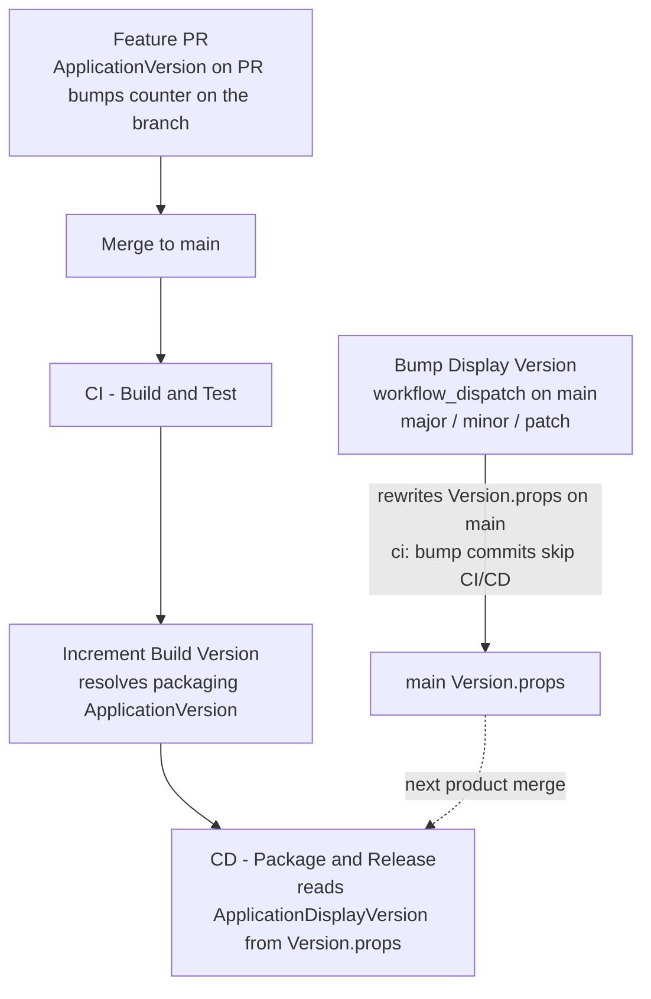

# Version management

Single source of truth: root [`Version.props`](../Version.props).

| Property | Meaning | Who changes it |
|----------|---------|----------------|
| `ApplicationDisplayVersion` | User-facing semver (`Major.Minor.Patch`) | Human via **Bump Display Version** workflow |
| `ApplicationVersion` | Integer build counter | **ApplicationVersion on PR** (feature branches) and **Increment Build Version** (after successful CI on `main`) |

Every platform package (APK, MSIX, snaps, etc.) reads the same file. There is
nothing per-platform to bump.

## Current model (trust workflows, not old prose)



### Display version (semver)

1. GitHub → **Actions** → **Bump Display Version**
2. Run on **`main`**
3. Choose `major` / `minor` / `patch`  
   Example: `1.7.116` + **major** → **`2.0.0`**
4. Workflow opens a short PR and squash-merges it (main is protected).
5. That bump commit is intentionally **not** packaged (`ci: bump` skips CI → no CD).

To ship a product release as **2.0.0**, put `2.0.0` on `main` **before** the
product merge that should package, or follow
[agent-playbook-merge-client-pr-v2.md](agent-playbook-merge-client-pr-v2.md).

### Build counter

- On PRs: **ApplicationVersion on PR** keeps the branch counter ahead of
  published `-bN` releases.
- On `main` after green CI: **Increment Build Version** dispatches CD with the
  packaging `ApplicationVersion`.
- Release **name**: `VardyParty v{display}-b{build}`  
  Release **tag**: `{display}-b{build}` (no leading `v` — `release.yml` on `v*`
  tags is a separate path).

### Local check

```bash
grep ApplicationDisplayVersion Version.props
grep ApplicationVersion Version.props
```

## Do not

- Hand-edit `ApplicationDisplayVersion` on a product feature branch (conflicts
  with the bump workflow on the same line).
- Confuse `ApplicationVersion` (155, 156, …) with the display semver.
- Expect the bump workflow to create git tags or run CD by itself.
