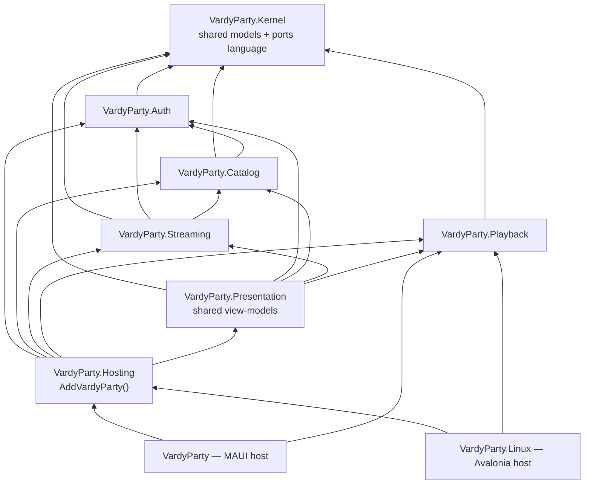
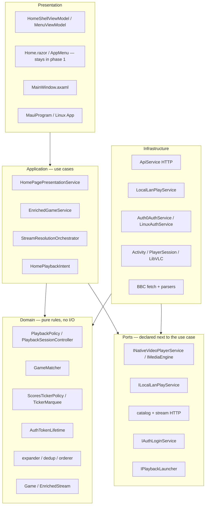
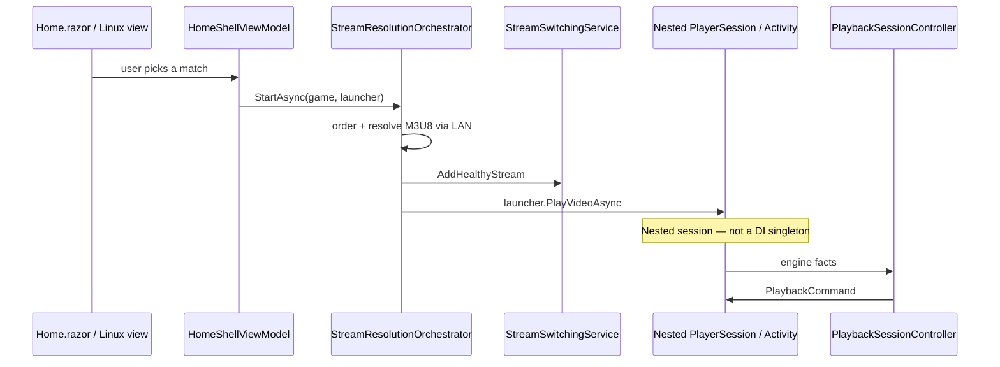
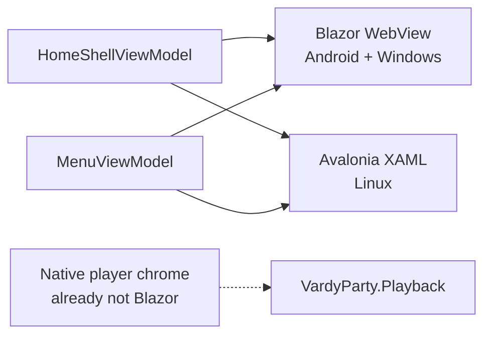

# Phase 1 canvas — domain assemblies + Clean Architecture

**In scope:** redistribute `VardyParty.Core`, shared view-models, acyclic composition.  
**Out of scope:** replacing Blazor WebView with XAML — see [phase-2-webview-xaml.md](phase-2-webview-xaml.md).

---

## 1. Target assemblies (vertical slices)

Domain projects, not `*.Domain` / `*.Application` / `*.Infrastructure` solutions. Layers live **inside** these.

**Hard rule:** Streaming must not reference Playback. Playback must not reference Streaming. Presentation wires “start this game” via `IPlaybackLauncher` (method-injected), not a singleton player inside the orchestrator.

`VardyParty.Core` is deleted. Types live in the domain assemblies above. Clean Architecture rings are folders **inside** each domain csproj (`Domain/`, `Application/`, `Infrastructure/`), not extra solution projects.

---

## 2. What each assembly owns

| Assembly | Domain | From today’s Core (and new types) |
|---|---|---|
| **Kernel** | Shared language | `Game`, `EnrichedStream`, stream/playback DTOs, config POCOs, `ApiSystemDownException`. No I/O, no DI graph. |
| **Auth** | Identity | `AuthTokenLifetime`, `IAuthLoginService`, `IAuthTokenProvider`, `Auth0ApiTokenHandler` |
| **Catalog** | What matches exist | `EnrichedGameService`, `HomePagePresentationService`, BBC parsers/services, `GameMatcher`, league filter/logos, display helpers, `ScoresTickerPolicy`, `TickerMarquee` |
| **Streaming** | Get a playable URL | Resolver, expander/dedup/orderer, orchestrator, coordinator, LAN LocalService client, stream/M3U8 HTTP (`IApiService` : `IGamesCatalogApi`), health probe I/O |
| **Playback** | Play and recover | `PlaybackPolicy`, `PlaybackSessionController`, `IMediaEngine`, `INativeVideoPlayerService`, `StreamSwitchingService` |
| **Presentation** | Shared VMs | `HomeShellViewModel`, `MenuViewModel`, `HomePlaybackIntent` (`SelectionState` lives in Kernel) |
| **Hosting** | Composition | `AddVardyParty()` — only project that references every domain |

**Hosts** (`VardyParty`, `VardyParty.Linux`) implement OS adapters: Auth0 vs Linux PKCE, nested `PlayerSession` / `NativeVideoActivity` / LibVLC. Nested player sessions are **not** DI services.

Ticker **policy** stays in Catalog. Ticker **animation** stays in the host (already native on Android/Windows).

---

## 3. Clean Architecture rings (horizontal)

Same onion in every domain assembly. Arrows point inward.

| Layer | This app |
|---|---|
| **Domain** | Matcher, playback policy/session, ticker policy, token lifetime math, stream expand/dedup/order. No `HttpClient`, no Activity/WinUI. |
| **Application** | Load the card grid, start resolution, fill the healthy pool, click-vs-resume intent. |
| **Infrastructure** | HTTP, LAN, BBC fetch, Auth0/Linux stores, ExoPlayer/WinUI/LibVLC. |
| **Presentation** | Shared VMs, Blazor/Avalonia, composition roots. |

Do **not** add `VardyParty.Domain.csproj` + `Application` + `Infrastructure` at solution level — that cuts across Catalog/Streaming/Playback and recreates a god Core.

---

## 4. Match playback (target)

---

## 5. Phase 1 UI hosts

Android/Windows home stays Blazor until **phase 2**. Player chrome and scores ticker are already native.
