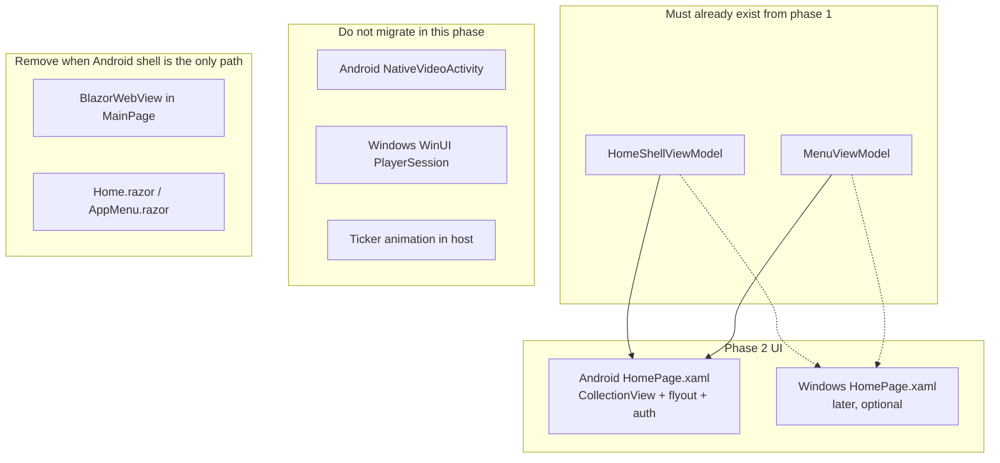

# Phase 2 (separate) — Blazor WebView → MAUI XAML

**This is not part of phase 1.** Do not start it until [phase-2-plan.md](phase-2-plan.md) slice 1 (Home.razor → VMs) is done. Canvas only: shared VMs exist; `Home.razor` still owns too much of the shell.

On the table for **Android performance** of the **home shell**. Player chrome and scores ticker are already native.

---

## Canvas

---

## Why Android, and why not player/ticker

The remaining Blazor cost is the **home shell in Chromium WebView** (game list, auth, flyout, stream-discovery overlay). Android keeps that WebView **resident under** `NativeVideoActivity`. Windows already tears Blazor out of the window when playback starts (`MainPage.IsNativePlayerActive`).

XAML **does** buy: no Blazor circuit / JS D-pad interop, `CollectionView` virtualization vs every `GameCard` in the DOM, WebView gone during playback, native TV focus.

XAML **does not** buy: ExoPlayer/WinUI/LibVLC decode, LocalService, Auth0, catalog/BBC polling.

---

## Sequencing (after phase 1)

1. Feature-flag or `#if ANDROID` XAML home bound to the **same** VMs; Windows stays Blazor.  
2. Keep `NativeVideoActivity` unchanged.  
3. Optional: Windows XAML home, then delete WebView, `wwwroot`, Razor, Cast JS interop.  
4. Do not add bUnit tests as a destination.

**Do not** make the first architecture PR “Android HomePage.xaml”.
