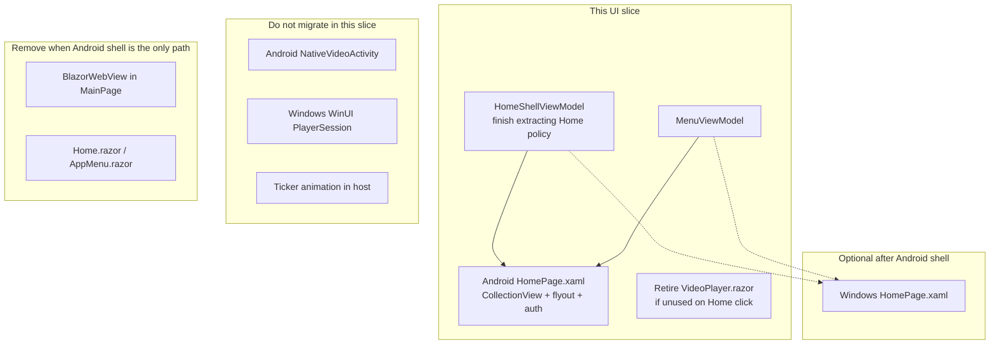

# Phase 2 UI — Blazor WebView → MAUI XAML

**Last slice of [phase-2-plan.md](phase-2-plan.md).** Do not start this until slices 1 (Linux auth) and 2 (`PlaybackCommand`) are done. Do **not** rewrite `Home.razor` first — remaining Home policy moves into the shared VMs **in this slice**, as the Android XAML binding target.

On the table for **Android performance** of the **home shell**. Player chrome and scores ticker are already native.

---

## Canvas

---

## Why Android, and why not player/ticker

The remaining Blazor cost is the **home shell in Chromium WebView** (game list, auth, flyout, stream-discovery overlay). Android keeps that WebView **resident under** `NativeVideoActivity`. Windows already tears Blazor out of the window when playback starts (`MainPage.IsNativePlayerActive`).

XAML **does** buy: no Blazor circuit / JS D-pad interop, `CollectionView` virtualization vs every `GameCard` in the DOM, WebView gone during playback, native TV focus.

XAML **does not** buy: ExoPlayer/WinUI/LibVLC decode, LocalService, Auth0, catalog/BBC polling.

---

## Sequencing (this slice only)

1. Tests for remaining Home commands on the VMs, then bind Android `HomePage.xaml` to those VMs. Windows stays Blazor on the same VMs.  
2. Keep `NativeVideoActivity` unchanged.  
3. Retire or route `VideoPlayer.razor`.  
4. Optional later: Windows XAML home, then delete WebView, `wwwroot`, Razor, Cast JS interop.  
5. Do not add bUnit tests as a destination.

**Do not** make the first phase 2 PR “Android HomePage.xaml”. Host adapters first.
